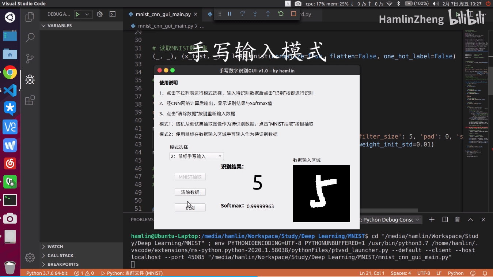

# Python+Numpy+PyQt implement CNN to recognize handwritten number

## Overview



For more presentations please visit: https://www.bilibili.com/video/BV127411b7hK


## How to run

**Prerequisites**

- Python3 (Tested in Python 3.8.10)
- Pip
- Venv

### Run main GUI

1. Create a Python virtual environment (*Optional*)

```
$ python3 -m venv venv
$ source venv/bin/activate
```

2. Install the required packages

```
$ pip install -r requirements.txt
```

3. Run the main GUI

```
$ python ./mnist_cnn_gui_main.py
```

> You can modify the network structure in `mnist_cnn_gui_main.py` file, and two networks are provided by default.


### Train model

Train Simple CNN:

```
$ python ./train_convnet.py
```

Train Deep CNN:

```
$ python ./train_deepnet.py
```


## Acknowledgement

- 《深度学习入门-基于Python的理论与实现》
